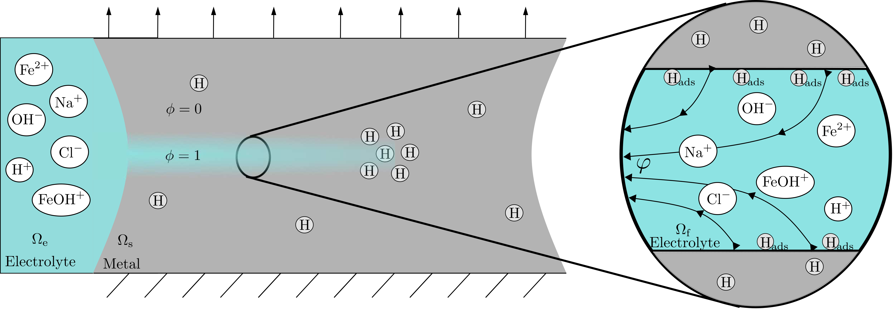

# Physics-based diffusion within cracks and hydrogen embrittlement simulation

If this code is used, please cite XXXXXXXXX

Matlab code performing the finite element simulation of an electrolyte contained within a phase-field representation of cracks. A novel diffusion model is used to represent the electrolyte within phase-field fractures, allowing for accurate predictions of the hydrogen uptake while also simulating propagating cracks. Full documentation is available [here](Documentation/main.pdf).
